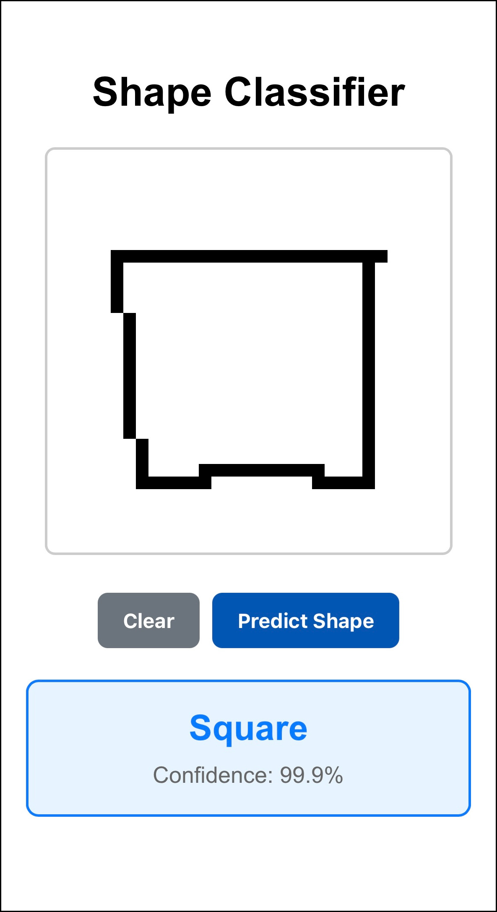

# shape-classifier

This is a simple web application for classifying hand-drawn shapes (Circle, Square, Rectangle, Triangle) using a TensorFlow.js model.

## Features

- Draw shapes on a 32x32 pixel canvas.
- Clear the canvas to draw again.
- Predict the drawn shape with confidence score displayed.

## Usage

- Draw a shape on the canvas using mouse or touch.
- Click "Predict Shape" to classify the drawing.
- Click "Clear" to erase the canvas and start over.

## Screenshot

